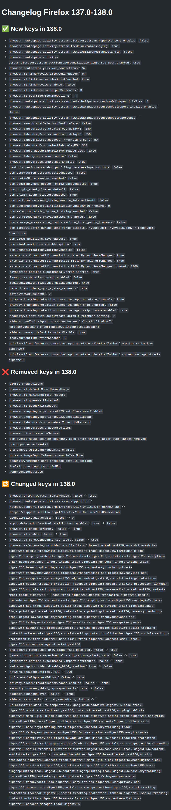

# ff_diff

ff_diff is a simple node script to compare changes in user.js preference files between two versions of Firefox. You don't need to mess with your firefox instance.

Features:

- Compares user.js files from two specified Firefox versions
- Automatically downloads official Firefox binaries
- Highlights differences without requiring a local Firefox installation

Requirements:

- Internet connection (for downloading Firefox binaries)
- node >= 22 and npm
- tar

## Usage

Clone this repository:

```bash
git clone https://github.com/martabal/ff_diff.git
cd ff_diff
npm ci
```

Run the comparison script:

```bash
npm run ff_diff <version1> <version2>
```

for example:

```bash
npm run ff_diff 137.0 138.0
```

The Firefox sources will be downloaded into the `dist/` directory. By default, the script keeps the archives and the sources extracted from the archives. If you want to remove them, you can execute the script with the `--clean-archives` `--clean-sources` arguments. If you use a custom `user.js`. You can check if some of the keys are removed/changed with the argument `--compare-userjs <path_to_your_userjs>`.

> [!NOTE]  
> The script may take some time to run depending on your connection speed.

Example of a generated changelog:


